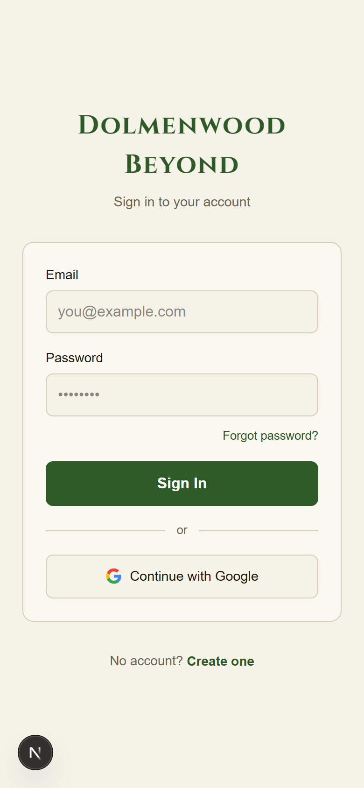
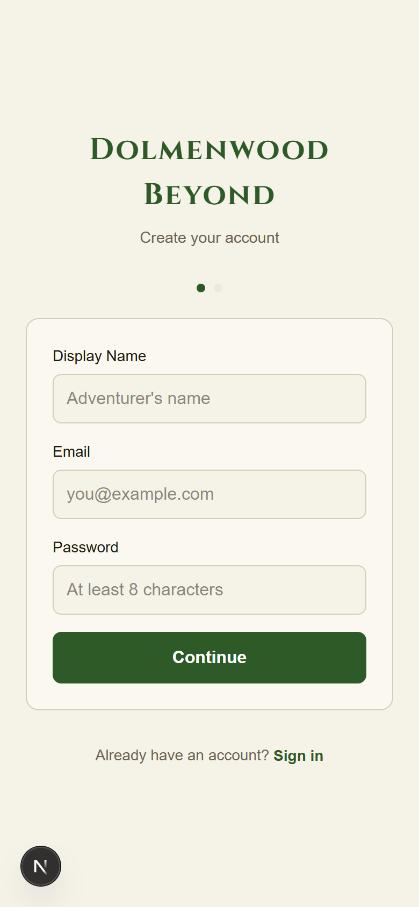
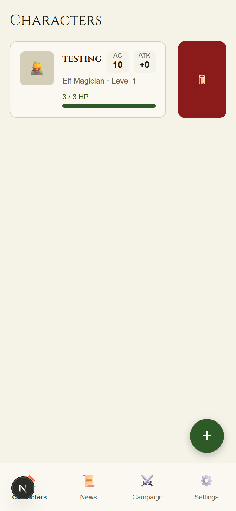
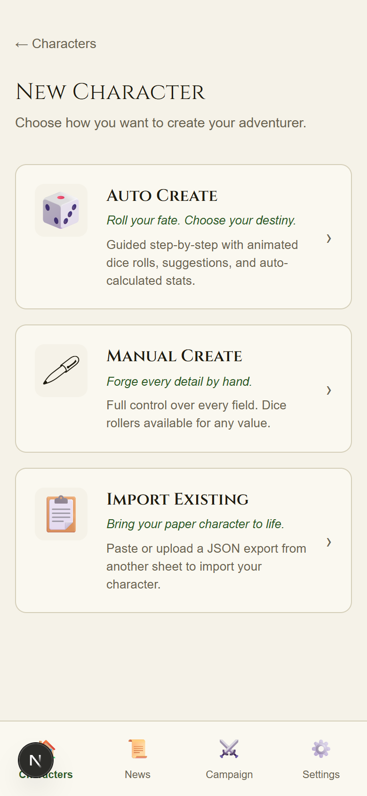
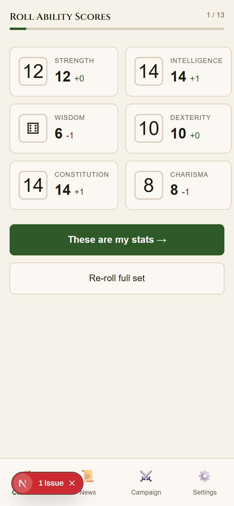
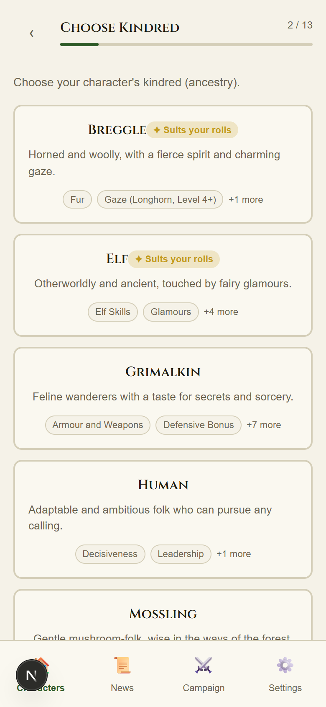
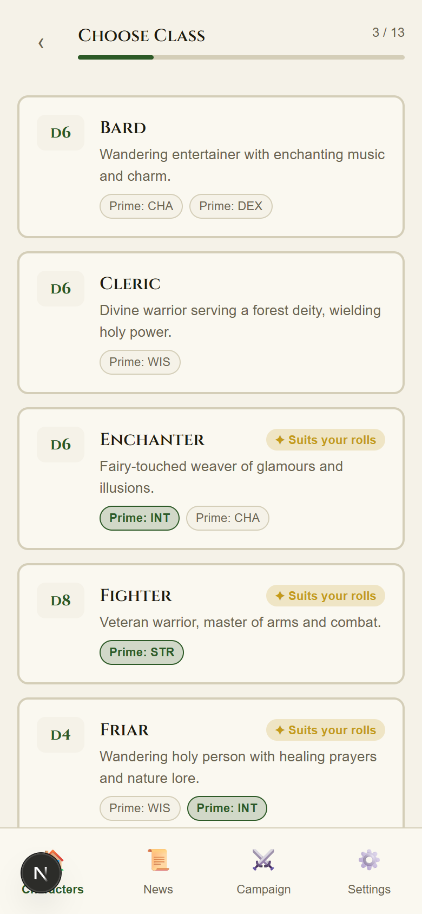
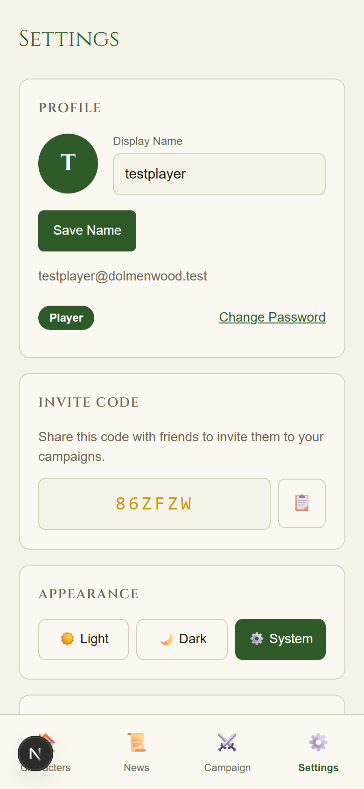

# Dolmenwood Beyond Dev Log #2 — Debugging a Live App: RLS Recursion, Extension Schemas, and Auto-Publishing Blogs

Dev Log #1 covered building the entire application. This one is shorter but arguably more instructive: what happens when you actually *run* it.

I fired up the full local stack for the first time — Supabase, Next.js, all five migrations — and found three bugs before I even got past the sign-up screen. None of them were logic errors in the application code. All three were in the database layer. Here's what they were, why they happened, and how I fixed them.

*Screenshots of the running app are at the bottom of this post.*

---

## Bug 1: `gen_random_bytes` Vanishes Inside Supabase Auth

### The symptom

Sign up a new user. Get this:

```
500: Database error saving new user
"msg": "Database error saving new user",
"error_id": "9891341a-4ca1-4ac1-9e40-b92e9d12c37f"
```

The application code wasn't even running yet. The error came back from `supabase_auth_dolmenwood-beyond` — the Auth container — before the Next.js app touched anything.

### Finding the real error

The Supabase auth API error message is deliberately vague for security reasons. To get the actual database error, you have to look at the auth container logs:

```bash
docker logs supabase_auth_dolmenwood-beyond --tail 30
```

The real message:

```
ERROR: function gen_random_bytes(integer) does not exist (SQLSTATE 42883)
```

### Why this happens

The `handle_new_user()` trigger fires after every `INSERT` on `auth.users`. My trigger called `gen_random_bytes(4)` to generate a random invite code for each new account. That function is part of the `pgcrypto` extension.

The problem is **search path**. The Supabase Auth service connects to PostgreSQL with a restricted `search_path` that excludes the `public` schema — where `pgcrypto` gets installed. From the auth service's connection context, `gen_random_bytes` simply doesn't exist.

When I ran the same function call manually from a `psql` session or via the REST API with the service role key, it worked fine — because those connections have `public` in their search path.

### The fix

Fully qualify the function with its schema:

```sql
-- Before (fails in auth service context)
code := upper(substring(encode(gen_random_bytes(4), 'base64') from 1 for 6));

-- After (works everywhere)
code := upper(substring(encode(extensions.gen_random_bytes(4), 'base64') from 1 for 6));
```

One word prefix. Thirty minutes to find it.

**Lesson**: Any PostgreSQL function called from a `SECURITY DEFINER` context or from a service with a non-standard `search_path` needs to be fully qualified. Don't assume `pgcrypto`, `uuid-ossp`, or any extension function is reachable without the schema prefix in all contexts. In Supabase, extension functions live in the `extensions` schema.

---

## Bug 2: Infinite RLS Recursion on the Characters Page

### The symptom

Sign in successfully. Navigate to the Characters page. The app shows:

```
Failed to load characters: infinite recursion detected in policy for relation "campaign_members"
```

PostgreSQL error code `42P17`. The characters query never returned — it recursed until Postgres cut it off.

### Why RLS policies can recurse

Row Level Security policies are evaluated for *every* query on a protected table. If policy A on table X runs a sub-query against table Y, and policy B on table Y runs a sub-query back against table X, you get infinite recursion.

My schema had exactly this:

**Policy on `campaign_members`** — "Referees can view all members in their campaigns":
```sql
using (
  exists (
    select 1 from public.campaigns        -- queries campaigns
    where id = campaign_members.campaign_id
      and referee_id = auth.uid()
  )
);
```

**Policy on `campaigns`** — "Players can view campaigns they belong to":
```sql
using (
  exists (
    select 1 from public.campaign_members  -- queries campaign_members
    where campaign_id = campaigns.id
      and account_id = auth.uid()
  )
);
```

Querying `campaign_members` → evaluates policy → queries `campaigns` → evaluates policy → queries `campaign_members` → ♾️

The `characters` query hit this cycle through its "Campaign members can view each other's characters" policy, which joined `campaign_members` with `campaigns`.

### The fix: SECURITY DEFINER helper functions

The standard Supabase solution is to create helper functions marked `SECURITY DEFINER` that read a table **without triggering RLS**. Functions with `SECURITY DEFINER` run as their owner (the `postgres` superuser), which bypasses RLS entirely on the tables they query.

```sql
-- Bypasses RLS when checking campaign membership
create or replace function public.is_campaign_member(p_campaign_id uuid)
returns boolean
language sql
security definer
stable
set search_path = public
as $$
  select exists (
    select 1 from public.campaign_members
    where campaign_id = p_campaign_id
      and account_id = auth.uid()
  );
$$;

-- Bypasses RLS when checking campaign referee
create or replace function public.is_campaign_referee(p_campaign_id uuid)
returns boolean
language sql
security definer
stable
set search_path = public
as $$
  select exists (
    select 1 from public.campaigns
    where id = p_campaign_id
      and referee_id = auth.uid()
  );
$$;
```

Then replace all the cross-referencing policies to use these helpers:

```sql
-- campaigns policy — uses helper, no longer queries campaign_members directly
create policy "Players can view campaigns they belong to"
  on public.campaigns for select
  using (public.is_campaign_member(id));

-- campaign_members policy — uses helper, no longer queries campaigns directly
create policy "Referees can view all members in their campaigns"
  on public.campaign_members for select
  using (public.is_campaign_referee(campaign_id));
```

The chain is broken: `campaign_members` policy calls `is_campaign_referee()` which runs as postgres and reads `campaigns` **without evaluating RLS**. The cycle can't form.

### The set search_path annotation

Note the `set search_path = public` on the helper functions. This is a security hardening measure. Without it, a malicious user could potentially manipulate the `search_path` to shadow the target tables with their own objects. Always set an explicit `search_path` on `SECURITY DEFINER` functions.

**Lesson**: Any time two tables have RLS policies that cross-reference each other — even transitively through a join — you'll get infinite recursion. Design your policies to be "leaf" queries (terminating at a column check or a helper function) rather than "recursive" queries (triggering more policies). Introduce `SECURITY DEFINER` helpers at the points where you need to cross a table boundary.

---

## Bug 3 (Workflow): Blog Auto-Publish Was Fully Manual

This one wasn't a crash — it was a design gap I addressed while the first two bugs were being fixed.

The blog publishing workflow I built in Dev Log #1 was `workflow_dispatch` only. To publish a post, you had to manually go to the Actions tab, select the workflow, type in a filename, and click Run. That's fine for a one-off, but it defeats the purpose of having a pipeline.

### The new trigger

The updated workflow triggers on `push` to `main` whenever any `docs/blog/*.md` file changes:

```yaml
on:
  push:
    branches:
      - main
    paths:
      - 'docs/blog/**.md'
  workflow_dispatch:   # kept as manual fallback
    inputs:
      post_file: ...
      status_override: ...
```

### Detecting which files changed

The `detect` job uses `git diff` to find only the files that were **added or modified** in the specific commit:

```bash
git diff --name-only --diff-filter=AM HEAD^ HEAD -- 'docs/blog/*.md' \
  | grep -v 'README' \
  | grep '\.md$'
```

`--diff-filter=AM` means Added or Modified — deleted files are skipped. The result is piped through `jq` to produce a JSON array that the next job can use as a matrix.

### Matrix publish

The `publish` job runs as a `strategy.matrix` over the detected files. Each file gets its own runner:

```yaml
publish:
  needs: detect
  if: needs.detect.outputs.count > 0
  strategy:
    fail-fast: false    # publish others even if one fails
    matrix:
      post_file: ${{ fromJson(needs.detect.outputs.files) }}
```

`fail-fast: false` means if a post fails to publish (malformed front matter, WordPress API hiccup), the other posts in the same commit still go through.

### The workflow now

Drop a new `.md` file in `docs/blog/`, commit it to `main`, push. The pipeline picks it up automatically. The `status` field in the front matter controls whether it publishes as a draft or a live post — change it from `draft` to `publish` when you're ready.

---

## What the Local Stack Looks Like Now

After these three fixes, the full local test passed:

| Check | Result |
|-------|--------|
| All 5 migrations apply cleanly | ✅ |
| User signup creates `accounts` row with invite code | ✅ |
| Characters page loads without recursion error | ✅ |
| `/api/health` returns JSON | ✅ |
| Protected routes redirect unauthenticated requests | ✅ |
| Blog workflow triggers on push to `main` | ✅ |

Three migrations are now in the database that weren't in the PRD: one fixes a `gen_random_bytes` extension path, one adds the missing `invite_code` column that the settings page references, and one introduces the `SECURITY DEFINER` helpers to break the RLS cycle.

---

## A Note on Finding These Bugs

All three bugs existed because the application was never run end-to-end before this session. Unit tests can't find a `gen_random_bytes` search path issue — that only surfaces when the auth service actually connects. Integration tests could catch RLS recursion, but writing them requires a running Supabase instance. And workflow design gaps only matter when you have something to publish.

This is the part of development that can't be fully automated: actually running the thing and observing what breaks.

The fixes took less time than finding them. That's usually how it goes.

---

## What's Next

The core app is functional end-to-end. The remaining items from the backlog:

- **Retainer sheets** — NPCs with morale, loyalty, and pay tracking
- **Mount management** — horses, ponies, mules, and their encumbrance impact
- **Portrait upload** — S3/storage bucket is configured, upload UI is not built
- **Campaign/Party referee view** — the stub page needs real data
- **Real PWA icons** — 192×512 PNG files to replace the SVG placeholder

Next session will pick up retainer sheets and mounts — the two features players ask about most after character creation.

---

*Source: [github.com/madacgrav/dolmenwood-beyond](https://github.com/madacgrav/dolmenwood-beyond)*

---

## Screenshots — App Running Locally

All screenshots captured on a simulated iPhone 14 Pro viewport (390×844 @2x) using Puppeteer against the local dev stack.

### Auth screens

The sign-in and sign-up pages — the first thing that had to work before any of the bugs above could even be triggered.


*Sign-in: Cinzel serif, parchment background, Google OAuth option*


*Sign-up: two-step flow, step indicator dots visible at top*

---

### Characters roster

After signing in. The character card here is a test artifact from running the trigger test directly against `auth.users` during debugging — it proves the DB trigger was firing before the `gen_random_bytes` fix, just not through the auth service path.


*Characters page: card with HP bar, swipe-to-delete red panel, FAB (+) in corner, 4-tab bottom nav*

---

### Character creation wizard

The mode select and first three steps of the 13-step wizard.


*Mode select: Auto Create (animated dice rolls), Manual Create (full control), Import Existing*


*Step 1/13: rolled 3d6 per stat, modifiers shown in green/red, Re-roll option*


*Step 2/13: kindred cards with ✦ "Suits your rolls" badges based on rolled stats, trait chips*


*Step 3/13: class list with HD size, prime attributes highlighted, "Suits your rolls" badges*

---

### Settings — proof the fixes work

The settings page is the final confirmation that both migration 4 and migration 5 are working correctly. The invite code (`86ZFZW`) was generated by `extensions.gen_random_bytes()` at signup — the exact call that was failing before the fix.


*Settings: profile with Player role badge, invite code auto-generated on signup, theme toggle*
