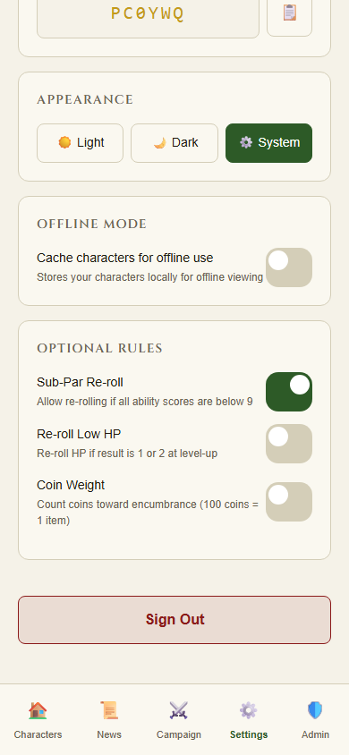
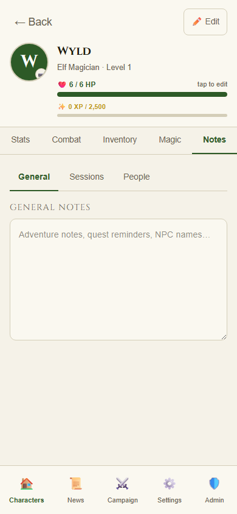
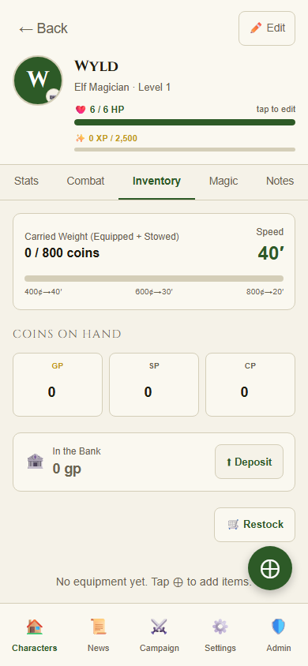
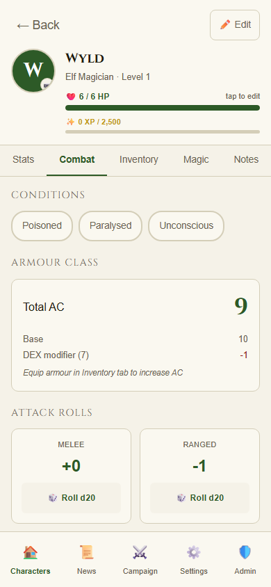
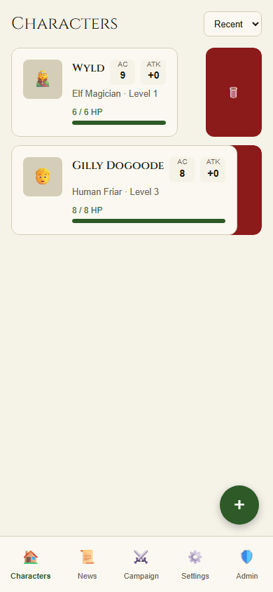

V1 started as a list of features on a PRD. It ended with five AI agents cross-examining the code, arguing about Breggle armour class, and discovering an export function that had been silently writing to a database table that doesn't exist.

This post covers everything since [Dev Log #5](./2026-05-09-dev-log-5-feature-velocity-and-code-review.md): a nine-feature sprint, four final gap-fillers, a multi-agent review pipeline, and the fixes that came out of it.

---

## The Final Sprint: Nine Features in One PR

PR #9 landed thirteen features from the original PRD. Here's what shipped:

**Forgot Password** — the flow most apps ship first and we shipped last. Email → reset link → `/reset-password` → new password via `supabase.auth.updateUser()`. Works.

**Optional Rules Settings** — three house rule toggles stored in `localStorage`:
- Sub-par re-roll (all scores ≤ 9 → re-roll banner in wizard)
- Re-roll low HP (1s and 2s on HP at level-up)
- Coin weight counts toward encumbrance

These are exposed via a `useOptionalRules()` hook so any component can read them without prop-drilling through half the character sheet.



**Session Notes and People of Note** — the Notes tab grew up. It now has three sub-tabs: General (the original textarea), Sessions (timestamped entries, one per session), and People (name + brief note pairs). Both new sections store as JSONB in the characters table.



**Promote Retainer to PC** — a retainer that survives long enough to become a full character can be promoted. The UI creates a proper character row from the retainer's data and sets `is_promoted_to_pc = true` to hide the retainer card. No data is lost.

**Ammo Counter and Battle View** — ranged weapons now show ammo count. "Start Battle" opens a modal with a large "Shot Fired" button that decrements quantity. Ending battle rolls for recovery (d6, recover half rounded down per Dolmenwood rules) and adds arrows back automatically.

**Restock Tool** — a bottom sheet on the Inventory tab with pre-defined consumables (arrows, torches, rations, oil, animal feed) and a running total vs. GP available. Confirmation auto-decrements gold.



**Portrait Upload** — tap the avatar in the character sheet header → file picker → uploads to Supabase Storage at `portraits/{character_id}` → public URL saved to `characters.portrait_url`. Kindred emoji fallback if null.

**Mount Management** — a `mounts` table with full stat block support. Knight warhorses get AC, HP, attack, saves, and morale. Other mounts show speed only. Character sheet has a collapsible Mounts section in the Combat tab.

**Read-Only Referee View** — referees can tap any party member's character card and get a full character sheet in read-only mode. No edit buttons, no HP adjusters. RLS policy added for `SELECT` access scoped to campaigns the referee manages.



---

## Infrastructure: The Build That Kept Breaking

Shipping nine features also meant fixing the deployment pipeline twice.

**AcrPull scope conflict** — changing the scope of an Azure role assignment breaks ARM. The pipeline started throwing `RoleAssignmentUpdateNotPermitted` because we'd tried to tighten the AcrPull assignment from resource-group level to ACR level. ARM saw the same GUID pointing at a different scope and rejected it. The fix was reverting to resource-group scope and documenting why in the codebase so no future agent flags it as a finding.

**Key Vault immutability** — `softDeleteRetentionInDays` cannot be changed after vault creation. ARM returns `BadRequest: The property has been set already and it can't be modified`. Documented and accepted; changing it requires destroying the vault and losing all secrets.

**CI path filters** — deploy workflows now skip when only documentation or config files change. No more production deploys triggered by a README edit.

---

## Closing the Gaps: Four More Features

After PR #9 merged, I ran a gap analysis against the original PRD. Most of it was done. Four things remained:

**Languages** — each kindred speaks specific native languages. INT modifier grants bonus language slots (one per +1 above neutral). The `getKindredLanguages()` function was already in the rules engine; it just wasn't wired into the character sheet. A new `extra_languages` JSONB column on characters stores learned languages. In edit mode, players can add and remove custom languages.

**Level Up Log** — every time a character levels up, the `level_up_logs` table records `from_level`, `to_level`, `hp_roll`, `hp_roll_final`, and a `changes` JSONB diff. There was no UI for it. A new page at `/characters/[id]/level-up-log` shows a timeline of all level-up events, newest first, accessible from a ⋮ menu in the character sheet header.

**Export Characters as JSON** — a "Data" section in Settings with a button that fetches all characters, inventory, spell slots, and preparations for the current user and triggers a browser download of a JSON file. No backend needed — client-side Supabase query + blob URL.

**Delete Account** — a "Danger Zone" section in Settings. Clicking the button opens a modal that requires typing `DELETE` before proceeding. On confirm, a `delete_my_account()` SECURITY DEFINER RPC deletes the user from `auth.users`, which cascades to all their data. Session cleared, redirect to sign-in.



---

## The Five-Agent Review Pipeline

With all features implemented, I ran five specialized review agents against the PR simultaneously:

```
┌──────────────────────────────────────────────────────────────┐
│                      PR #10 Branch                           │
└─────────┬──────────┬──────────┬──────────┬──────────────────┘
          │          │          │          │
          ▼          ▼          ▼          ▼          ▼
    code-review   Security   DevOps      QA        Developer
                 Reviewer   Reviewer  Reviewer    Architect
          │          │          │          │          │
          └──────────┴──────────┴──────────┴──────────┘
                               │
                     Triage → Fix → Commit
```


Each agent reviews from a different angle: data flow and error handling, security and RLS, deployment pipeline, test coverage and game rules, architecture and conventions. Running them in parallel takes the same wall-clock time as running one.

---

## Twelve Bugs That Mattered

Here are the findings that would have made it to production:

**Wrong table name (critical)** — The level-up log page queried `level_up_log`. The actual table is `level_up_logs`. Supabase RLS silently returns an empty result for queries against non-existent table names rather than raising an error. Every character would show an empty timeline with no indication that anything was wrong.

**Wrong column name (critical)** — The same page sorted by `created_at`. The actual timestamp column is called `timestamp`. Silent failure — no ordering, no dates displayed.

**Export pointed at a ghost table (critical)** — The export function fetched from `character_spells`. That table does not exist. The actual spell data lives in `spell_slots` and `spell_preparations`. Every export attempt would silently produce an empty array. Fixed to join `spell_slots(*)` and `spell_preparations(*)`.

**Breggle AC wrong since day one (high)** — Breggle kindred gets a +1 AC bonus. The rules engine has `getKindredACBonus()`. The character sheet called `calculateAC()` with `kindredACBonus: 0` hardcoded. Every Breggle character in the game had been displaying AC one point too high — for weeks, across every session, for every character with that kindred. Fixed by importing and calling `getKindredACBonus(character.kindred)`.

**delete_my_account missing auth guard (security)** — The SECURITY DEFINER RPC had no check for `auth.uid() IS NULL`. A call without a valid session (direct SQL or race condition) would have allowed deletion of arbitrary accounts. Fixed with `RAISE EXCEPTION` guard.

**search_path injection vector (security)** — The same RPC used `SET search_path = public`. SECURITY DEFINER functions should use `SET search_path = ''` and qualify all references explicitly. Fixed.

**URL.revokeObjectURL called before download (medium)** — The export function revoked the blob URL immediately after calling `click()`. Browser downloads are async; the file could be released before it finished transferring. Fixed with a 1-second delay.

**Dockerfile public/ missing --chown (devops)** — The `COPY public/ ./public/` step in the Dockerfile was missing `--chown=nextjs:nodejs`. Static assets were owned by root inside the container.

**Language limit not enforced (medium)** — Players could add unlimited custom languages regardless of INT modifier slots. Frontend-only validation added with rollback on Supabase error.

**Unsafe params.id cast (medium)** — The level-up log page did `params.id as string`. Next.js 15 params are `Promise<{ id: string }>` — the cast was correct syntax but the extraction was wrong. Fixed to use proper async param destructuring.

**Typed DELETE confirmation not working** — The delete account modal had a text comparison bug where the confirm button would enable incorrectly. Fixed the `deleteConfirmText` state comparison.

**Error handling missing in three places** — `addLanguage`, `removeLanguage`, and `handleExportData` had no error handling. Any Supabase error would fail silently or leave the UI in a broken state.

---

## What's Next

V1 is merged. The five-agent review closed the loop. The prod app has thirteen features that work correctly, a migration stack that's solid, and a CI pipeline that doesn't deploy when you fix a typo in the docs.

What comes after V1? The PRD has a v2 section — campaign-level features, dice roller integration, more referee tools. But first: PR #10 merges, and then we actually play the game.

---

*Dolmenwood Beyond is a personal project. The game itself is by [Gavin Norman / Necrotic Gnome](https://necroticgnome.com/products/dolmenwood-campaign-book).*
