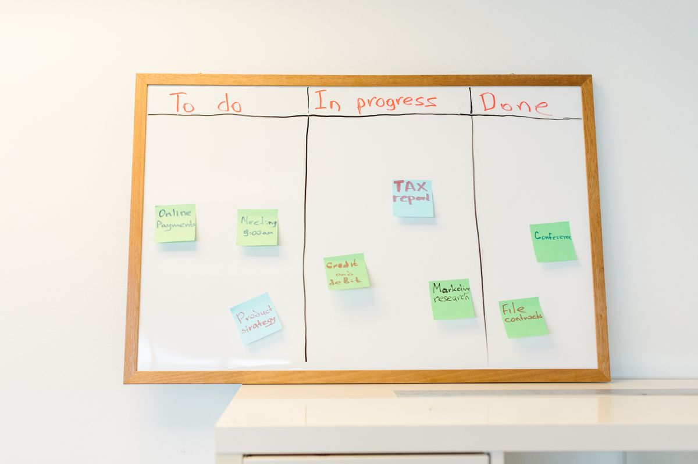
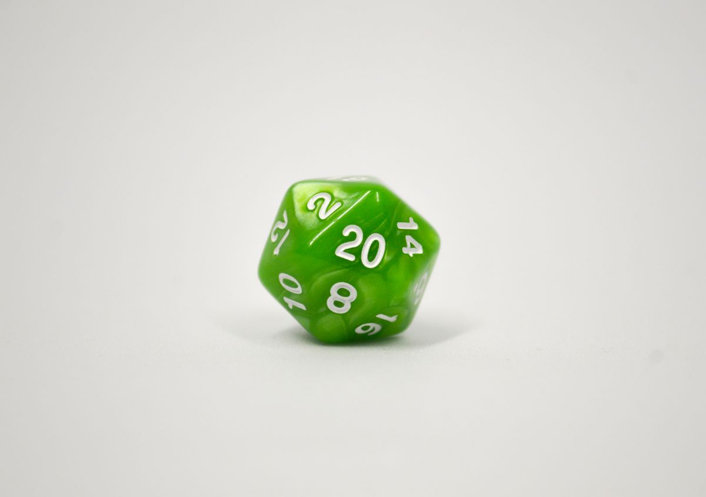

V1 shipped back in [Dev Log #6](./2026-05-10-dev-log-6-v1-complete-agent-reviews.md) on the back of GitHub Copilot Agent sessions. Since then the biggest change to Dolmenwood Beyond isn't a feature — it's *how* the features get built. I moved the whole project onto **Claude Code**, and I stopped firing one-shot prompts at the agent. Now every feature goes through an eight-step process called **QRSPI**.

This post is about that shift, and the work that came out of it.

---

## The change: from one big prompt to eight small ones

The old way was a single fat prompt: "build me the scheduling feature, here's the context, go." It worked, but the agent had to hold the entire problem — research, design, plan, and code — in one breath. When it got something wrong, it got it wrong deep inside a 1,000-line change that was hard to course-correct.

[QRSPI](https://github.com/matanshavit/qrspi) splits that one prompt into eight focused phases, each producing a small written artifact before the next begins:

| Phase | What the agent produces |
|-------|-------------------------|
| **Q**uestion | Neutral questions that force it to touch every relevant part of the codebase |
| **R**esearch | Objective facts about how things actually work today — no opinions |
| **Design** | A short "here's where we're going" document |
| **S**tructure | The slices and checkpoints for how we get there |
| **P**lan | The tactical, step-by-step working document |
| Worktree | An isolated git worktree to build in |
| **I**mplement | Execution, phase by phase, with verification |
| PR | The pull request, with context carried from the design |

The win is that I review the *Design* (a couple hundred lines) and the *Structure* (about two pages) — not a giant plan and not the raw diff. If the agent has misunderstood something, I catch it on page two instead of in code review. Each feature now leaves a paper trail under `thoughts/qrspi/` showing exactly what was asked, researched, and decided.

If you want the full rationale behind the eight phases, the [QRSPI README](https://github.com/matanshavit/qrspi/blob/main/README.md) lays it out well.

---

## What got built this way

**Campaign scheduling calendar + availability voting.** Referees can post candidate play dates; every participant marks themselves free or busy on each one. When *everyone* marks a date available, the proposal atomically confirms itself — it drops a real session onto the campaign calendar and fans out an in-app notification to the whole party. A month-grid calendar view and a bell/badge in the app shell round it out. This was the first feature I ran end-to-end through QRSPI, and the design doc caught the tricky part (concurrent final approvals shouldn't create duplicate sessions) before any code existed.

**A "what's actually missing" audit.** I pointed the process at the original PRD and had it find the gaps between what was promised and what shipped. That turned into a tidy sweep: the manual character-creation wizard now covers all of steps 8–13, the optional-rules toggles are wired to real behavior instead of just sitting in settings, the character sheet shows real equipped-armor AC, there's a quick dice-roller tab, and the PWA finally has proper raster icons.

**Animated dice rolls.** Skills checks, saving throws, and attack rolls now shake a die and then reveal the pass/fail result, all driven by one shared `useDiceRoll` hook so every roller behaves consistently. Small thing, but it makes the app feel like a game instead of a spreadsheet.

---

## The review pipeline moved to Claude too

Dev Log #6's five-agent review ran on Copilot. I rebuilt it on Claude: the old auto-implement and blogger-reviewer workflows are gone, and the four expert personas (architect, DevOps, security, QA) now emit **structured findings** that a synthesis step dedupes and ranks into a single consolidated PR comment instead of four competing ones. There's also a local `/review` slash command that runs the same personas against my working diff *before* I open the PR — same reviewers, no waiting on CI, no API spend.

---

## What's next

The process is the feature now. Everything from here — the v2 campaign tools, more referee features — goes through the same eight steps, which means each one shows up with its own design doc I can argue with before a line of code is written.

And, as always: at some point I should stop building the game and go play it.

---

*Dolmenwood Beyond is a personal project. The game itself is by [Gavin Norman / Necrotic Gnome](https://necroticgnome.com/products/dolmenwood-campaign-book).*
